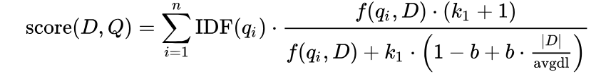

# RAG-against-the-machine

Build a Retrieval-Augmented Generation system that answers questions about codebases by retrieving relevant information and generating evidence-based responses, implementing intelligent chunking, efficient retrieval (TF-IDF/BM25)

# Resources

###### General

- [General explanation](https://www.mrlatte.net/en/research/2026/04/27/rag-complete-guide/)
- [RAG with embedding](https://medium.com/@shravankoninti/mastering-rag-a-deep-dive-into-embeddings-b78782aa1259)
- [Embeddings](https://www.youtube.com/watch?v=v6g8eo86T8A)
- [Data chunking strategies](https://developer.ibm.com/articles/awb-enhancing-rag-performance-chunking-strategies/)
- [Grounded generation](https://zeroentropy.dev/concepts/grounded-generation/)
- [Chat templates](https://huggingface.co/docs/transformers/en/chat_templating)

###### Huggingface

- [Loading Models](https://huggingface.co/docs/transformers/models?)
- [Good Transformers course (if u had time)](https://huggingface.co/learn/llm-course/chapter1/2)

###### Bonus

- [Embeddings/Word embeddings](https://www.tensorflow.org/text/tutorials/word_embeddings)
- [Embeddings/Word embeddings](https://www.youtube.com/watch?v=hVM8qGRTaOA)
- [Semantic Search](https://www.sbert.net/examples/sentence_transformer/applications/semantic-search/README.html#symmetric-vs-asymmetric-semantic-search)

**Model Overview**
_Qwen3-0.6B has the following features:_

    Type: Causal Language Models
    Training Stage: Pretraining & Post-training
    Number of Parameters: 0.6B
    Number of Paramaters (Non-Embedding): 0.44B
    Number of Layers: 28
    Number of Attention Heads (GQA): 16 for Q and 8 for KV
    Context Length: 32,768

#### BM25

###### Formula

